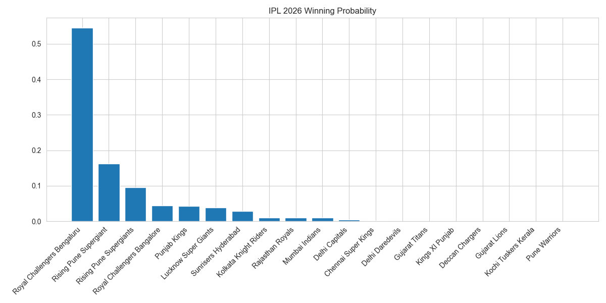

# 🏏 IPL 2026 AI Predictor

A premium, data-driven simulation engine designed to predict IPL 2026 outcomes using advanced Machine Learning and team momentum tracking.



## 🚀 Overview
This project leverages historical ball-by-ball data to build a predictive model that accounts for team "form" using an **Elo Rating System**. The frontend is built with **Streamlit** and features a custom **Glassmorphism UI** for a high-end user experience.

## 🧠 Technical Highlights
*   **Predictive Engine:** Utilizes an **XGBoost Classifier** trained on 1,100+ unique matches.
*   **Momentum Tracking:** Implements a custom **Elo Rating algorithm** to quantify team strength dynamically based on their match history.
*   **High-Speed Simulation:** Optimized tournament simulations using **Probability Matrix Pre-calculation**, allowing 1,000+ permutations to run in <1 second.
*   **Premium UI:** Custom CSS-injected Glassmorphism interface with official team branding and smooth animations.

## 🛠️ Tech Stack
*   **Language:** Python 3.11+
*   **ML Libraries:** XGBoost, Scikit-learn, Joblib
*   **Data Processing:** Pandas, NumPy
*   **Frontend:** Streamlit, Custom CSS
*   **Visualization:** Plotly, Seaborn, Matplotlib

## ⚙️ Installation & Usage

1. **Clone the repository:**
   ```bash
   git clone https://github.com/yourusername/ipl-predictor.git
   cd ipl-predictor
   ```

2. **Install dependencies:**
   ```bash
   pip install -r requirements.txt
   ```

3. **Run the Application:**
   ```bash
   streamlit run app.py
   ```

4. **(Optional) Retrain the Model:**
   ```bash
   python model/train_model.py
   ```

## 📊 Dataset
The model is trained on a comprehensive ball-by-ball IPL dataset, pre-processed into match-level features including team indices and Elo ratings at the time of each match.